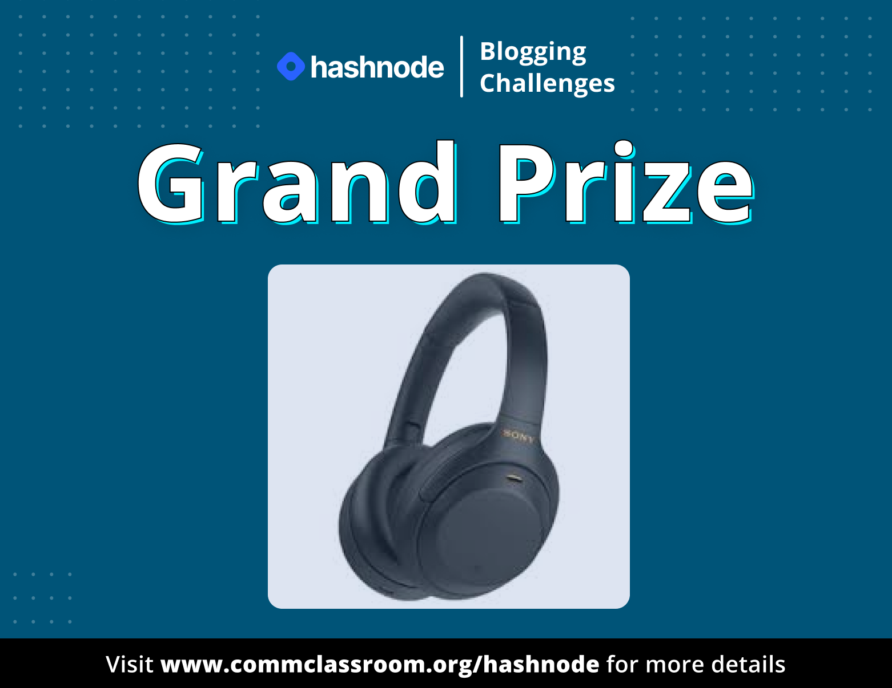

# Hashnode Blogging Challenge

## What is the blogging event?

Every month we will be having 4 tracks. You can write one or multiple blogs on the given tracks. The best blogs will receive hashnode swag.

There will also be one grand prize for every month. The prize will go to the one who writes multiple great blogs throughout the month. For the grand prize, you can wrtie on any of the 4 tracks.

## Previous winners

Check out some of the previous winners of the Hashnode Challenge.

    
  
  
  
  
  
  

## How to participate?

You can participate in a few simple steps.

:one: Write and publish a blog of the given themes on hashnode and use the hashtag `#BlogsWithCC` while publishing it.

:two: Share your blogs on Twitter and tag `@WeMakeDevs` and `@hashnode`.

## How to win the Grand Prize
Each month there will be a grand prize such as apple Iphones, Macbook, etc.

At the end of the month, the person who write's the best blogs will win the grand prize.

## Special Track
Apart from the 4 tracks mentioned above, we will ocassionally be having a special track as well. This special track will be based on a certain theme for the month. 

You can write blogs on the given theme, submit them, and win a special prize as well. 

> Note: The Special Prize will be different from the grand prize.

## Previous special track winners

  
  
  

## What are the prizes for this month

We have 2 exciting prizes for November! Check then out :point_down:

    
  
  

## What are the tracks for the current month?
Below you can find the current tracks for this month.

  
  
  
  

For the special track, share your expereinces during KubeCon NA 2022, and you can win a [LFX Training Voucher](https://lfx.linuxfoundation.org/tools/training-portal/) worth $499!

## Previous Winners

Check out some of the previous winners of the Hashnode Challenge.

    
  
  
  
  
  
  

## General info
👉 If you want to get your blogs reviewed by the community members, drop a link to your published blog in the discord server

👉 If you have questions related to the challenge, drop them in the discord server

If you have any questions about the event, drop a message in our [Discord Server](https://discord.com/invite/wemakedevs) 

