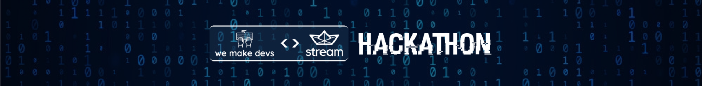
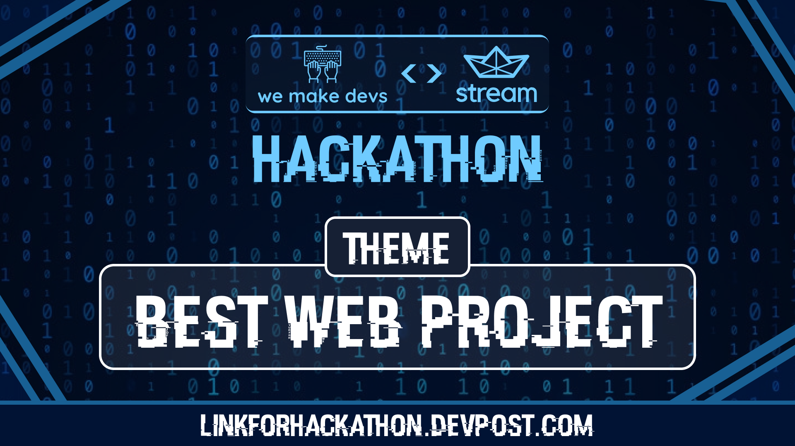
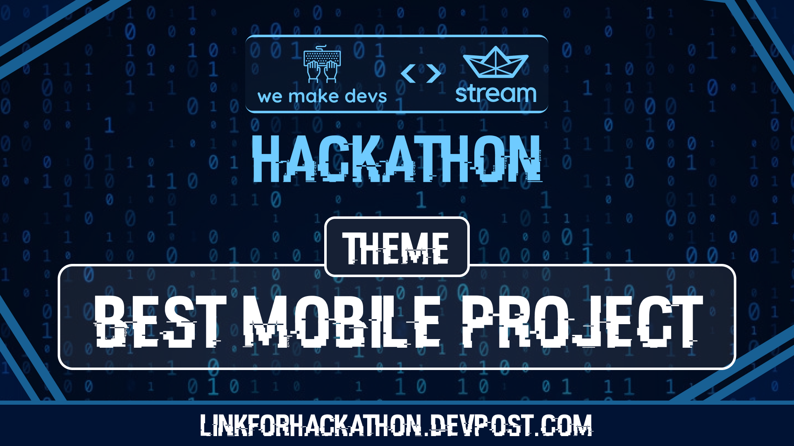
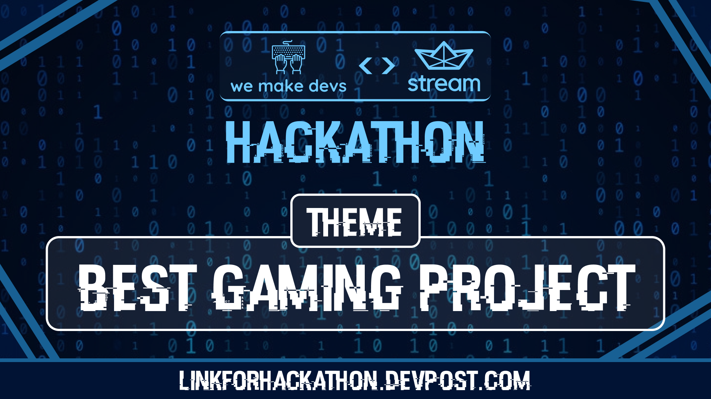
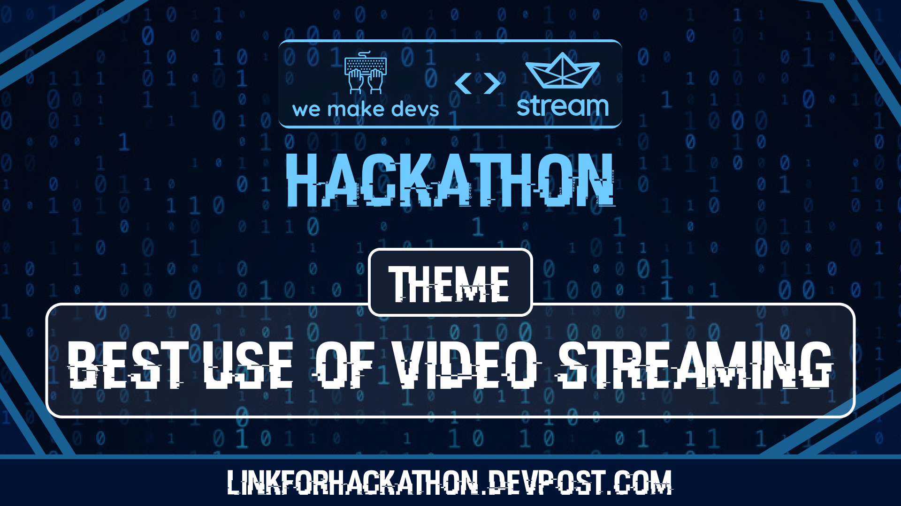
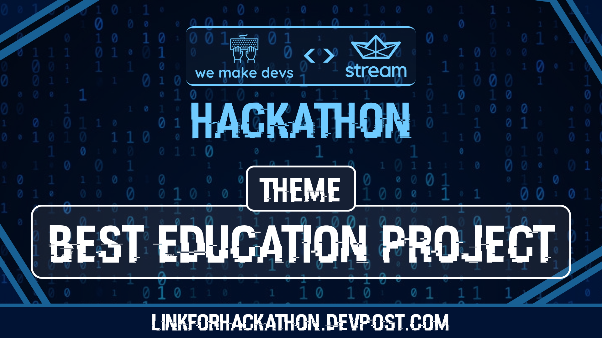

# WeMakeDevs <> Stream Hackathon

Open Source is for everyone and even the smallest of contributions counts. The only thing you require to start is the will to learn and explore. Getting hands-on experience is one of the best ways to get started. 

The WeMakeDevs <> Stream Hackathon is the right place for you to be if you believe in learning by doing. All you need is the will to learn and the grit to build!

This "learn by doing" approach is what the WeMakeDevs <> Stream Hackathon is all about. The desire to learn and explore is all that you need to get started!

## Timeline

> All timings are in IST

### 16th December

- **12 pm - 6 pm**: Announcements + Workshops
- **6 pm**: Hacking begins
  
### 17th December

- Hacking continues

### 18th December

- Hacking continues

### 19th December

- **12 am**: Submissions Begin
- **11 am**: Devpost office hours in the discord server
- **12 pm**: Submission Deadline
- **12 pm - 8 pm**: Judging Period
- **9 pm**: Winner announcement
  
*The timeline is subject to change

## How to join the hackathon?

- Head over to [Devpost](https://wemakedevs-stream.devpost.com/) and register for the hackathon.
- Join the [Discord server](https://discord.com/invite/wemakedevs) to get all updates.
- Read and follow the [code of conduct](https://wemakedevs-stream.devpost.com/rules).
- [Explore stream](https://getstream.io/chat/?utm_source=kunalk&utm_medium=hackathon&utm_content=Developer&utm_campaign=kunalkhackathon_December2022_Trial_klmh22) and come up with project ideas
- Start hacking on 16th December, 6pm IST.
  
## Tracks

  
  
  
  
  

## Prizes

- $100USD cash prize to every track winner.
- 1:1 live mentorship + interview with the winning team.
- Swags to all team members. 

